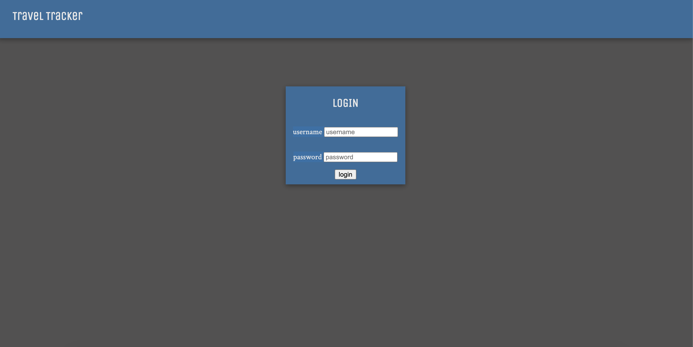
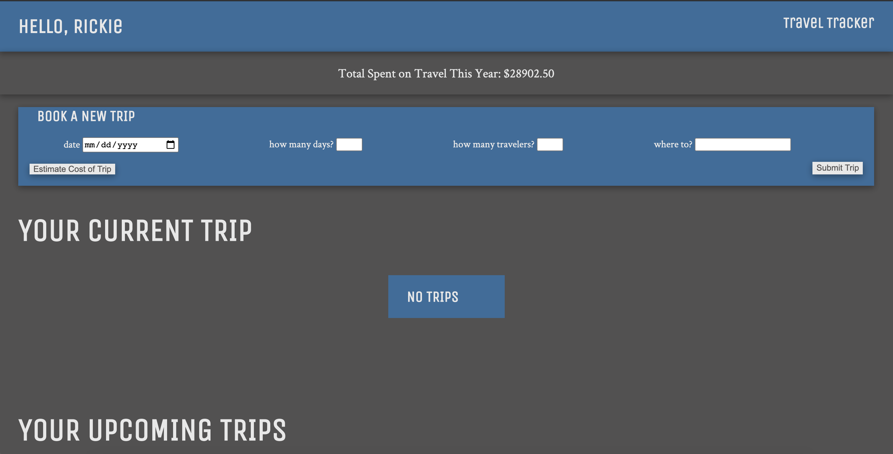
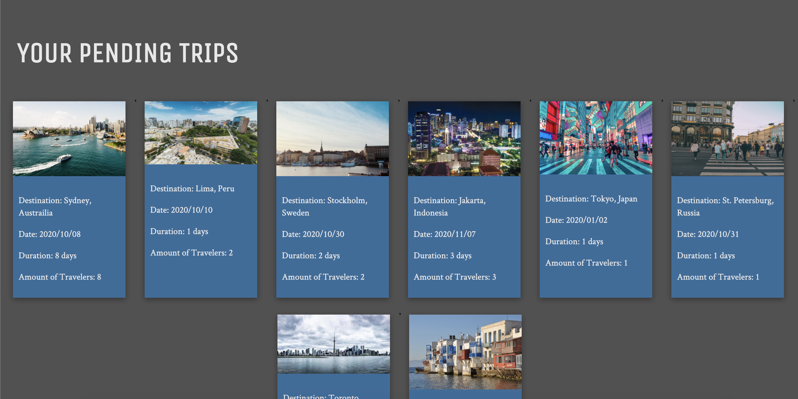

# Travel Tracker

## What is this?
   This was a Mod 2 project for Turing's front end engineering program, exploring building an application from scratch, creating a full testing suite for the classes, and using fetches user data from an API, and posts to that API as well. It emulates a travel app that keeps track of a user's past, current, and future trips, and allows the user to select and submit a a new trip.

## Who was involved?  
[Tim Keresey](https://github.com/timkeresey)

## How to use it?
- Clone Down This Repo
- Run NPM Install
- Run NPM Start to start your server
- Open [this link](http://localhost:8080/) in your browse
- Any edits are now live in real time

## Technologies Used
- Javascript
- html
- [Sass](https://sass-lang.com/)
- [Webpack](https://webpack.js.org/)
- [Moment](https://momentjs.com/)
- [Lighthouse](https://developers.google.com/web/tools/lighthouse)
- [Fetch](https://developer.mozilla.org/en-US/docs/Web/API/Fetch_API)
- [Mocha](https://mochajs.org/)
- [Chai](https://www.chaijs.com/)
- [Chai Spies](https://www.chaijs.com/plugins/chai-spies/)

## How did it go?
   This project was a challenge. Many of the concepts of asynchronous JS were still fresh and had not been implemented before. A lot of time was spent tracking down and fixing bugs once the initial challenge of setting up the structure was achieved. Overall though, it was a success. All required functionality was achieved and a lot of learning was done.

## Where can we go now?
    - Implementation of a travel agent class and functionality for user of that type.

## In Action:

### Login Screen

### User Dashboard

